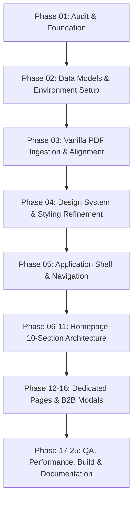

# 🏛️ ESSENCE INDONESIA — Master Implementation Audit & Architectural Roadmap
### Premium Indonesian Commodity Exporter (Vanilla 50% · Coffee 50%)

---

## 1. Executive Context & Brand Positioning

* **Official Brand Name**: `ESSENCE INDONESIA` *(No extra descriptors)*.
* **Company Positioning**: *Premium Indonesian Commodity Exporter*.
* **Primary Hero Statement**: `INDONESIAN ORIGINS. SOURCED FOR THE WORLD.`
* **Strategic Product Architecture**:
  ```text
                      ESSENCE INDONESIA
                             │
                   INDONESIAN ORIGINS
                       /           \
                  VANILLA         COFFEE
                     50%             50%
  ```
* **Tone of Experience**: *"Luxury at first glance. Serious exporter underneath."* Combining quiet luxury, editorial storytelling, Indonesian terroir, B2B commercial intelligence, and export readiness.

---

## 2. Product Data Baselines & Guardrails

### A. Vanilla (Authoritative Source: `Dokumen/ESSENCE INDONESIA NEW CATALOG.pdf`)
* **Verified Botanical Types**:
  * *Planifolia Indonesia* (HS `0905.10`): Gourmet, A, B, C; 13–21 cm; 2.0%–3.0% Vanillin; Balsamic, sweet, warm notes.
  * *Tahitensis* (HS `0905.10`): Gourmet, A, B, C; 13–16 cm; 1.0%–1.5% Vanillin; Floral, fruity, complex notes.
* **Verified Value-Added Derivatives**:
  * *Crystallized Vanilla* (HS `2106.90.99`): Vanillin >2.5%, Glass Tube.
  * *Vanilla Caviar* (HS `0905.20.00`): Moisture 30–35%, Vanillin 2%.
  * *Dried Vanilla Seeds* (HS `0905.20.00`): Moisture ≤10%, Vanillin >1%.
  * *Vanilla Powder* (HS `0905.20`): 100% natural, pure ground.
  * *Vanilla Paste* (HS `1302.19.90`): With visible seeds, 1L HDPE.
  * *Vanilla Extract (Alcohol & Non-Alcohol)* (HS `1302.19.90`): 1L HDPE.
  * *Vanilla Essence* (HS `2106.90`): Commercial food-grade extract.
* **Verified Compliance**: Halal Certified, P-IRT, ISO 22000, Food-Grade, GMO-Free, Gluten-Free, Allergen-Free.

### B. Coffee (Mockup Product Guardrails)
* **Status**: Equal strategic pillar with **zero invented claims**.
* **Allowed Language**: *"Indonesian Coffee"*, *"Selected Indonesian Origins"*, *"Available Upon Inquiry"*, *"Commercial Details Upon Inquiry"*.
* **Prohibitions**: No fake cupping scores, no invented farm/cooperative names, no fabricated altitude/harvest metrics, no unverified annual capacity numbers.
* **Structure**: Clean, production-ready B2B data architecture (Green Coffee, Specialty & Commercial Grades, Export Specs like Moisture ≤12.5%, Defect tolerances, Screen sizes) ready for real data insertion.

### C. General Sourcing & Heritage Claims
* **Allowed**: Family business heritage, hand-cured artisanal tradition, direct sourcing from Indonesian origins, international food safety compliance.
* **Prohibited**: Claims of 820+ Ha owned estates, 140+ specific farmer families, 100% parcel traceability, or artificial agronomist bios unless officially documented.

---

## 3. Comprehensive Implementation Matrix

### 🟢 KEEP (Reusable Primitives & Engine)
| Item | Location | Rationale |
| :--- | :--- | :--- |
| **Vite & React 18 Setup** | `package.json`, `vite.config.js` | Fast HMR, high build performance (~71 kB gzip bundle). |
| **Modular CSS Design Tokens** | `src/styles/tokens.css`, `layout.css`, `animations.css` | Warm Ivory (`#F6F2EA`), Obsidian (`#171512`), Espresso (`#241C17`), Vanilla Gold (`#C8A96B`), Double-bezel cards, custom scrollbar. |
| **Scroll Hooks** | `src/hooks/useScrollHeader.js`, `useScrollProgress.js`, `useScrollReveal.js`, `useScrollSpy.js` | Calm interaction baseline (80% static + 20% calm motion). |
| **Core UI Primitives** | `src/components/Button.jsx`, `ScrollReveal.jsx`, `FloatingConcierge.jsx`, `BrandLogo.jsx` | Reusable button-in-button architecture, viewport triggers. |
| **Official Vector Logos** | `Dokumen/loasosoaoaso.svg`, `logo-full.svg`, `public/logo-emblem.svg` | Authentic Essence Indonesia SVG assets converted and ready. |
| **Editorial Vanilla Media** | `src/assets/images/`, `public/videos/` | High quality macro photography, 360 bundle turntable, and macro video reel. |
| **Modular Data Layer** | `src/data/brand/`, `src/data/vanilla/`, `src/data/coffee/`, `src/data/quality/`, `src/data/sourcing/` | Fully structured separate data domain registry. |

---

### 🟡 MODIFY (Architectural Evolution)
| Target File | Current State | Required Modification |
| :--- | :--- | :--- |
| **`index.html`** | Single vanilla meta tags | Update Title, SEO meta, OpenGraph, JSON-LD Schema to *Essence Indonesia — Premium Indonesian Commodity Exporter (Vanilla & Coffee)*. |
| **`src/sections/Hero.jsx`** | "Pure Vanilla, Grown with Intention" | Transform to: **"INDONESIAN ORIGINS. SOURCED FOR THE WORLD."** with dual-pillar gateway (Vanilla & Coffee). |
| **`src/sections/Philosophy.jsx`** | Single vanilla manifesto | Evolve into **04 ESSENCE INDONESIA**: 3 pillars (*Origin, Quality, Reliability*) representing both commodities. |
| **`src/sections/TheVanilla.jsx`** | Standalone vanilla section | Streamline into the full **05 VANILLA VERTICAL** showcase with bean anatomy hotspots, flavor architecture, and derivative selector. |
| **`src/sections/TheCraft.jsx`** | Standalone craft steps | Integrate into Vanilla & Sourcing craftsmanship narrative. |
| **`src/sections/QualitySpecs.jsx`** | Vanilla-only specs | Broaden into **07 QUALITY & SOURCING**: Comprehensive laboratory testing, phytosanitary standards, and export certifications for both commodities. |
| **`src/sections/ClosingInquiry.jsx`** | Vanilla-only quotation CTA | Transform into **09 SOURCING INQUIRY**: Dual-commodity B2B quoting engine with multi-channel WhatsApp & Email triggers. |
| **`src/components/InquiryModal.jsx`** | Vanilla single-product form | Upgrade to multi-commodity selector (Vanilla Whole Beans, Vanilla Derivatives, Green Coffee Beans, Dual Sample Kit), volume metrics (kg/MT), and Incoterm preferences (FOB/CIF). |
| **`src/components/SpecSheetModal.jsx`** | Single Planifolia Grade A table | Multi-tab Technical Dossier covering Planifolia, Tahitensis, Derivatives (Caviar/Extracts/Powder) and Green Coffee Export Specs with Print/Save to PDF. |
| **`src/pages/AboutPage.jsx`** | Fictional agronomist bios & 820 Ha claims | Refactor into authentic **Essence Indonesia Heritage**: Trusted origin stewardship, sustainable trade ethics, and international export mission. |
| **`src/App.jsx`** | Uses `RoutePlaceholder.jsx` for several routes | Connect complete 10-section homepage narrative and dedicated view switching. |

---

### 🔴 DELETE / CLEANUP
| Target | Reason for Deletion |
| :--- | :--- |
| **Unverified Claims** | Removal of all "820+ Ha", "140+ farmer families", "100% parcel GPS tracking" from active components. |
| **`src/components/RoutePlaceholder.jsx`** | Replaced by fully functional dedicated sections and pages. |
| **Legacy Duplicate Data Files** | Deprecate root `src/data/specifications.js`, `craftSteps.js`, `brandStory.js` in favor of modular `src/data/` structure. |

---

### 🟣 NEW (Required New Modules)
| Component / File | Purpose & Architecture |
| :--- | :--- |
| **`src/sections/TwoOrigins.jsx`** | **02 TWO ORIGINS**: 50/50 visual & strategic gateway immediately establishing the dual pillar of Essence Indonesia. |
| **`src/sections/SelectedOrigins.jsx`** | **03 SELECTED INDONESIAN ORIGINS**: Terroir map & agroclimatic narrative of Indonesian volcanic archipelagos (Sumatra, Java, Bali, Flores, Sulawesi). |
| **`src/sections/CoffeeSection.jsx`** | **06 COFFEE**: Equal 50% pillar showcase with elegant highland editorial photography, green bean export standards, and inquiry hooks. |
| **`src/sections/BuyerIntelligence.jsx`** | **08 FOR INTERNATIONAL BUYERS**: Commercial readiness section outlining sampling, container logistics, documentation, and trade flow. |

---

## 4. Per-Section Breakdown

```text
01 HERO ─────────────────── Indonesian Origins Statement (Hero.jsx)
     ↓
02 TWO ORIGINS ──────────── 50/50 Dual Pillar Gateway (TwoOrigins.jsx)
     ↓
03 SELECTED ORIGINS ─────── Terroir & Archipelago Map (SelectedOrigins.jsx)
     ↓
04 ESSENCE INDONESIA ────── Origin, Quality, Reliability (Philosophy.jsx)
     ↓
05 VANILLA SHOWCASE ─────── Whole Beans & All Derivatives (TheVanilla.jsx)
     ↓
06 COFFEE SHOWCASE ──────── Green Coffee B2B Standards (CoffeeSection.jsx)
     ↓
07 QUALITY & SOURCING ───── Certifications & Lab QA (QualitySpecs.jsx)
     ↓
08 FOR BUYERS ───────────── Logistics, Incoterms & Trade (BuyerIntelligence.jsx)
     ↓
09 SOURCING INQUIRY ─────── B2B Quote & Concierge Form (ClosingInquiry.jsx)
     ↓
10 DARK CLOSING ─────────── Editorial Footer & Directory (Footer.jsx)
```

---

## 5. Phased Implementation Dependencies



---

> **Phase 01 Audit Complete.** Ready for Phase 02 upon user review and approval.
